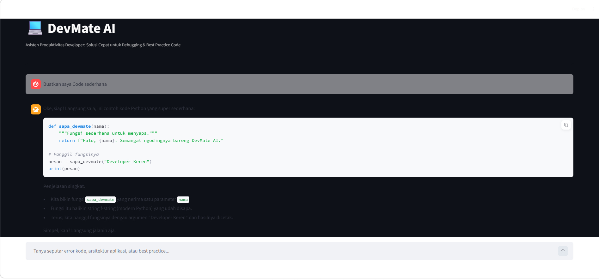

# 💻 DevMate AI - Developer Productivity Assistant

DevMate AI adalah chatbot cerdas berbasis *Large Language Model* (LLM) yang dirancang khusus untuk menjadi asisten produktivitas bagi *developer*. Aplikasi ini dapat membantu memecahkan masalah (*debugging*), merancang arsitektur aplikasi, dan memberikan *best practice* seputar pengembangan Web dan Mobile.

Proyek ini dibuat sebagai **Final Project** untuk program **Maju Bareng AI**.

## ✨ Fitur & Parameter Kreatif
- **Domain Pengetahuan Spesifik:** Dioptimalkan untuk menjawab pertanyaan seputar *Full-Stack Web Development* dan *Mobile Engineering* (seperti Laravel, Flutter, Kotlin, PHP, Tailwind CSS, JavaScript, dan Python).
- **Gaya Bahasa:** Santai, praktis, dan *straight to the point* layaknya seorang *senior developer*.
- **Context-Aware (Memory):** Dilengkapi dengan fitur memori untuk mengingat riwayat percakapan sebelumnya menggunakan `st.session_state`.
- **Modern UI/UX:** Antarmuka interaktif dengan balutan kustomisasi *Dark Mode* yang nyaman di mata *developer*.
- **Error Handling:** Dilengkapi penanganan *error* untuk status API *High Demand* (503) atau *Quota Exceeded* (429).

## 🛠️ Teknologi yang Digunakan
- **Python 3**
- **Streamlit** (Frontend / UI Framework)
- **LangChain** (LLM Framework & Prompt Templating)
- **Google Gemini API** (Core LLM - `gemini-2.5-flash`)

  

