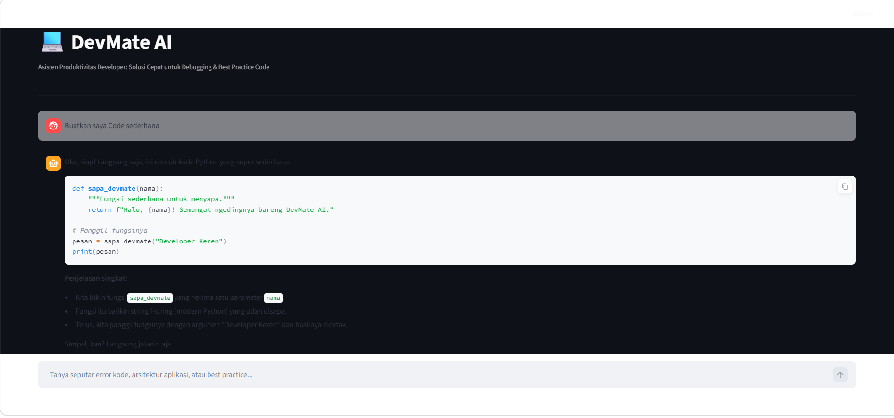

# 🚀 DevMate AI - Your Pair Programming Partner

DevMate AI adalah chatbot cerdas berbasis *Large Language Model* (LLM) yang dirancang khusus untuk menjadi asisten produktivitas bagi *developer*. Aplikasi ini dapat membantu memecahkan masalah (*debugging*), merancang arsitektur aplikasi, dan memberikan *best practice* seputar pengembangan Web dan Mobile.

Proyek ini dibuat sebagai **Final Project** untuk program **Maju Bareng AI**.

## ✨ Fitur Utama
- 🧠 **Domain Pengetahuan Spesifik:** Dioptimalkan untuk menjawab pertanyaan seputar *Full-Stack Web Development* dan *Mobile Engineering* (seperti Laravel, Flutter, Kotlin, PHP, Tailwind CSS, JavaScript, dan Python).
- 💬 **Gaya Bahasa Senior Developer:** Santai, praktis, dan *straight to the point*.
- 💾 **Context-Aware (Memory):** Mengingat konteks percakapan sebelumnya sehingga obrolan lebih mengalir (dibatasi 10 pesan terakhir untuk optimasi token).
- 🎨 **Premium UI/UX:** Antarmuka interaktif yang diperbarui dengan desain *Premium Dark Mode*, tipografi modern, avatar kustom, panel sidebar, dan tata letak yang bersih.
- 🛡️ **Error Handling yang Kuat:** Dilengkapi penanganan *error* untuk status API *High Demand* (503) atau *Quota Exceeded* (429) dengan UI *feedback* yang estetik.

## 🛠️ Teknologi yang Digunakan
- **Python 3.10+**
- **Streamlit** (Frontend / UI Framework)
- **LangChain** (LLM Framework & Prompt Templating)
- **Google Gemini API** (Core LLM - `gemini-2.5-flash`)

## 🚀 Cara Menjalankan Secara Lokal

1. Clone repositori ini:
   ```bash
   git clone https://github.com/putraharapantafonao/devmate-ai-chatbot.git
   cd devmate-ai-chatbot
   ```

2. Buat Virtual Environment (Opsional tapi direkomendasikan):
   ```bash
   python -m venv env
   env\Scripts\activate  # Untuk Windows
   # source env/bin/activate  # Untuk Mac/Linux
   ```

3. Install dependensi:
   ```bash
   pip install -r requirements.txt
   ```

4. Konfigurasi Environment Variables:
   Buat file `.env` di direktori utama, lalu tambahkan API Key Google Gemini Anda:
   ```env
   GOOGLE_API_KEY=your_google_api_key_here
   ```

5. Jalankan aplikasi Streamlit:
   ```bash
   streamlit run app.py
   ```

[](https://devmate-ai-chatbot.streamlit.app/)

<p align="center">
  
</p>